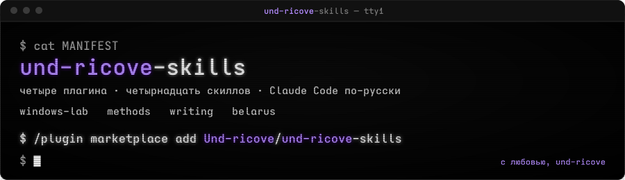

# und-ricove-skills

<p align="center"></p>

<p align="center">


</p>

Скиллы одной домашней лаборатории для Claude Code. Собраны за лето 2026 на живой работе:
Windows 11 с русским языком, проверки чисел в отчётах, статьи для чтения человеком,
железо и хостинг для Беларуси. Каждый скилл писался после оплаченной ошибки, поэтому
в них много «ловушек» и мало теории.

С любовью, из лаборатории.

## Установка

Маркетплейс добавляется одной командой, плагины ставятся по отдельности:

```
/plugin marketplace add Und-ricove/und-ricove-skills
/plugin install windows-lab@und-ricove-skills
/plugin install methods@und-ricove-skills
/plugin install writing@und-ricove-skills
/plugin install belarus@und-ricove-skills
```

Без GitHub: распакуй архив и укажи путь к папке:

```
/plugin marketplace add C:\путь\к\und-ricove-skills
```

Скиллы вызываются как `/windows-lab:encoding-check`, `/methods:number-forensics` и т.д.,
а также сами по контексту задачи.

## Карта пака

```text
und-ricove-skills/
├── windows-lab/   encoding-check  elevated  logs  hw-health  gpu  update-check  display-diag
├── methods/       number-forensics  data-triage  foreign-code  vault-hygiene
├── writing/       article-craft
└── belarus/       pc-build-belarus  vps-probe
```

## Что внутри

### windows-lab — Claude Code на Windows по-русски

| Скилл | Зачем |
|---|---|
| `encoding-check` | Смоук-тест UTF-8 во всех трактах: pwsh 7, PowerShell 5.1, Git Bash, Python, файлы, git. Кракозябры и «вопросики» ловятся до того, как испортят файл |
| `elevated` | Правки, требующие прав администратора, из обычной сессии: скрипт, UAC, файл-результат, проверка из того же канала |
| `logs` | Свежие ошибки журналов Windows со сводкой по-русски, без простыни |
| `hw-health` | Маркеры стабильности железа: WHEA, BSOD, TDR, Kernel-Power 41. Что откатить в разгоне |
| `gpu` | Сводка NVIDIA: температуры, VRAM, клоки, P-state, процессы |
| `update-check` | Три разных Claude Code на одной машине и где живёт правда о версиях. Скрипт для хука SessionStart в `scripts/` |
| `display-diag` | Диагностика дисплея и шрифтового тракта: замер «мыла», сглаживание, обратимые переключатели. Скрипты в `scripts/` |

### methods — способы работать

| Скилл | Зачем |
|---|---|
| `number-forensics` | Проверка чисел в сводках: пересчёт на месте, независимость свидетельств, вес источника, «сниппет не равен карточке» |
| `data-triage` | Сортировка повреждённых данных: битые против целых, поиск доноров, карантин без потерь. Обязательно перед слиянием папок и баз |
| `foreign-code` | Форк, патч, сборка чужого кода: правки в исходники против правок в собранное, идемпотентность инструментов правки |
| `vault-hygiene` | Гигиена markdown-хранилища: метаданные, сироты, безопасные массовые правки, температура файлов как шкала приоритета |

### writing — статьи и страницы

| Скилл | Зачем |
|---|---|
| `article-craft` | Статьи и артефакты-страницы: типографика, палитра (`palette.md`), структура подачи, чистота русского языка, печать HTML в PDF |

### belarus — железо и хостинг

| Скилл | Зачем |
|---|---|
| `pc-build-belarus` | Подбор комплектующих и сборщиков ПК в Беларуси через открытый API каталога Onliner, Kufar и курс НБРБ, чек совместимости |
| `vps-probe` | Выбор VPS по реальной задержке, а не по рекламе: точки для пинга, помехи VPN |

## Как читать скиллы

Скиллы написаны на русском и рассчитаны на модель, а не на человека: короткие правила,
пороги с числами, ловушки с датой, когда они были оплачены. Даты внутри это история
правок, не срок годности. Пути вида `<папка скилла>` подставь под своё расположение.

## Лицензия

MIT. Берите, меняйте, делитесь.

---

## English

Skills from a single home lab for Claude Code, written in Russian: Windows 11 in a Russian
locale (UTF-8 everywhere, elevation from a non-admin session, event logs, hardware and GPU
health, Claude version checks, display diagnostics), working methods (number forensics,
damaged-data triage, foreign-code patching, markdown-vault hygiene), long-form writing with
Russian typography, and hardware/VPS sourcing for Belarus. Every skill was written after a
paid-for mistake, so they are heavy on traps and light on theory. Install the marketplace
with `/plugin marketplace add Und-ricove/und-ricove-skills`. MIT licensed.
